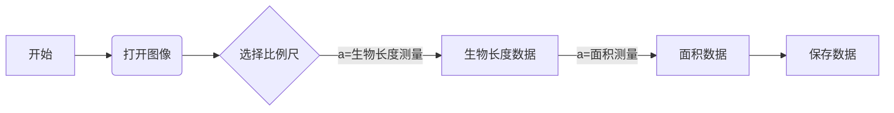
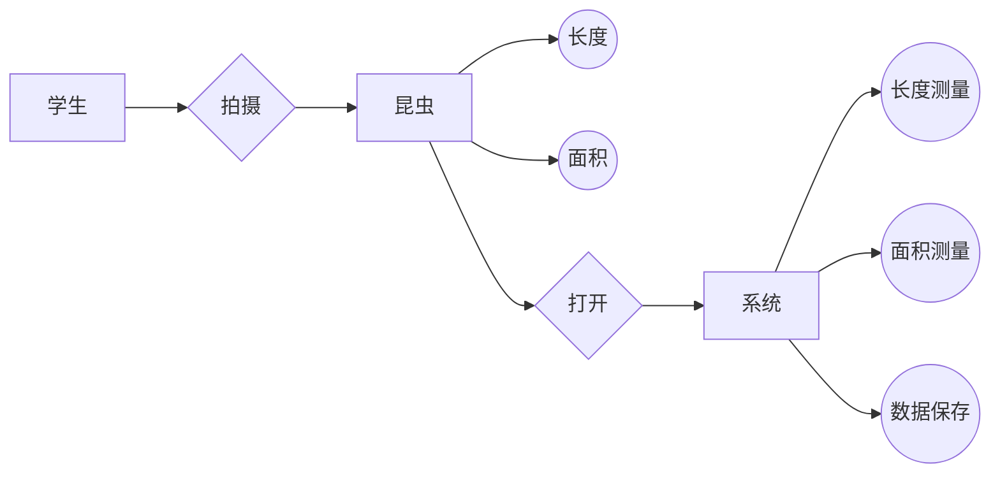

# 昆虫显微图像的生物量测量系统需求分析

## 1. 概述

### 1.1. 问题描述
昆虫是农业生态系统的组成部分,环境中昆虫的数量及其变化对农业生产有着重要的影响。  
生物量是指某一时间单位面积或体积栖息地内所含一个或一个以上生物种，或所含一个生物群落中所有生物种的总个数或总干重。  
通过对环境中昆虫显微图像的生物量的测量可以很好地反映农业环境的生态状况，对农业生产具有指导和参考意义。  

### 1.2. 系统简介
我们用到的生物量是指生物的大小（体积），我们认为生物（主要研究土壤动物）在生态系统中的功能可以用其大小来作为一个衡量标准，因此需要测量出其大小尺寸。  
本系统通过导入昆虫显微图片后，用户输入比例尺单位、数字，由系统判断比例尺对应的像素数量，再进行图像灰度化或二值化处理，并调用opencv库函数，如findContours（）函数进行轮廓检测，用drawContours（）绘制出轮廓边缘。  
最后提取选取图像的生物轮廓，并计算生物面积及长度。  

### 1.3. 目标读者
本系统开发人员，生物分析技术人员，农业技术人员  

### 1.4. 书写约定
HSV、HLS、Luv、Yuv、XYZ、YCbCr、Lab等，含义为各类灰度提取图片通道。  

## 2. 系统运行环境
Python版本：Python3.7.0  
OpenCV库版本：OpenCV4.5.1(进行计算机视觉与图像处理相关操作)   
PYQT5结合QT designer设计GUI界面  
IDE:Pycharm2020.03.05  

## 3. 系统功能需求

为实现系统对面积的测量，需要分五步进行。

### 1.第一项
        功能一：**打开图像**
        *用户在系统中按下打开图像按钮即可在系统页面内，打开需要测量的图像*
### 2.第二项
        功能二：**选取比例尺**
        *用户选取比例尺，作为图像处理的参考比例*  

### 3.第三项
        功能三：**测量长度**
        *手动选取节点构成生物骨架曲线，测量生物长度*  

### 4.第四项
        功能四：**面积计算**
        *将生物轮廓内的像素点数计算出来（红色区域内的像素点数量），测量生物面积 *  
  
### 5.第五项
        功能五：**保存数据**
        *用户可在测量完图像中昆虫生物量时，点击按钮保存测量的面积数据方便下次使用*

## 4. 系统非功能需求

### 4.1接口需求

       硬件：软件使用后有大量测量数据保存下来，可能需要外部存储设备（U盘）
       软件：软件和Windows操作系统的接口

### 4.2性能需求
|响应时间|操作量|系统容量|
|---|:--:|---:|
<3s|1|2GB

### 4.3安全性需求
      要求系统能经受住认为的不当操作
      具有信息完整性：在测量完成后，将测量数据保存在系统中存储，保护系统测量数据的完整

## 5. 需求分析模型

### 5.1. 功能模型 

### 5.2. 数据模型

### 5.3. 行为模型（可选）

无

### 5.4. 数据字典
流程图：  
开始形状/结束形状，“跑道圆”形状代表开始或者结束  
处理过程，“矩形”   
判断，“菱形”  
文件  
括弧，注释  
平行四边形，数据的输入或者输出  

ER图：方块-实体  
	菱形-联系  
	圆-属性  

## 6. 注意事项

无

